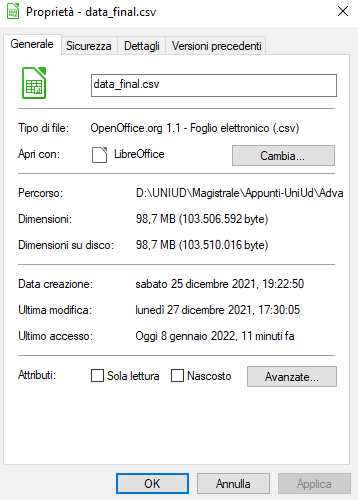
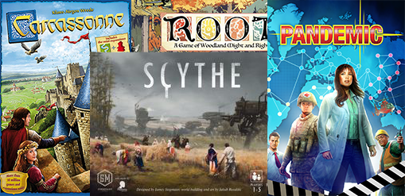
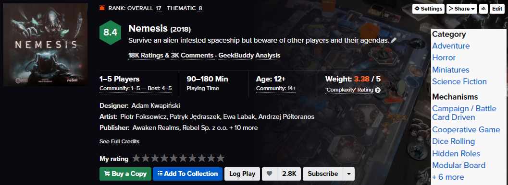
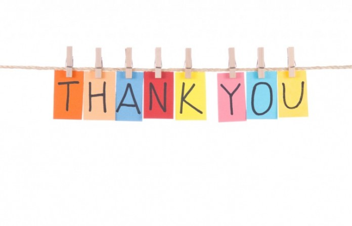

```{r setup, include=FALSE}
knitr::opts_chunk$set(echo = FALSE)
knitr::knit_engines$set(python = reticulate::eng_python)
library(dplyr)
library(tidyverse)
library(tidytext)
library(ggplot2)
library(igraph)
library(ggraph)
library(networkD3)
library(plotly)
library(DT)

csv_file = read_csv(file = 'data_final.csv')

csv_file_refined = csv_file %>% 
  mutate(category = str_split(category, "[.] ")) %>% 
  mutate(artists = str_split(artists, "[.] ")) %>% 
  mutate(designer = str_split(designer, "[.] ")) %>% 
  mutate(mechanics = str_split(mechanics, "[.] ")) %>% 
  mutate(publishers = str_split(publishers, "[.] ")) %>% 
  filter(!is.na(title))

## In substance it does this
## data %>% 
##   select(col) %>% 
##   unlist() %>% 
##   unique() %>% 
##   as_tibble()
get_uniques_entries = function(data, col){
  r = as_tibble(unique(unlist(select(data, col))))
  return(r)
}

categories = get_uniques_entries(csv_file_refined, 'category')

publishers = get_uniques_entries(csv_file_refined, 'publishers')

artists = get_uniques_entries(csv_file_refined, 'artists')

mechanics = get_uniques_entries(csv_file_refined, 'mechanics')

designers = get_uniques_entries(csv_file_refined, 'designer')

rm(get_uniques_entries)
```
## Il progetto

Il progetto in questione riguarda la creazione e lo studio di un database riguardante i giochi da tavolo. Questo database è stato generato utilizzando come fonte il sito https://boardgamegeek.com/ associato alla manipolazione dei dati fornita dal linguaggio R e dalle sue librerie. Tra le più famose tidyverse, diplyr, ggraph.

<br/>
<style>
  body {text-align: justify}
  table.display td {white-space:nowrap}
</style>
<br/>

<center>
  {width=70%}
</center>

### Motivazione della mia scelta
Avendo sviluppato un interesse riguardo il mondo dei giochi da tavolo ho pensato che sviluppare il progetto attorno a questa idea sarebbe stato un ulteriore stimolo per il progetto. Essendo a conoscenza dell'esistenza di un sito internet specializzato nel settore mi sono informato su come poter utilizzare quella grande quantità di dati a mio vantaggio. Venuto a conoscenza dell'API del sito mi sono deciso a sviluppare il codice che mi permetta di raccogliere questi dati e prepararli all'uso in R.

## Raccolta dei dati
La raccolta dati è stata fatta con uno script in python sviluppato per l'occasione. Lo script si interfaccia con l'API del sito ed attraverso delle richieste http e del parsing dei dati (ottenuti sotto forma di xml) è possibile ottenere un file .csv che contiene al suo interno le varie tuple dei giochi pronte per essere elaborate in R.

```{python main.py, echo=TRUE, eval=FALSE}
from dataParser import data_parser
from datadownloader import data_downloader

downloader = data_downloader('raw_data')
parser = data_parser('data', 'csv', 'raw_data')

starting_id, batch = 0, 1000
total_entries = 0

for i in range(starting_id, 400000, batch):
    print(f'Processing data from {i} to {i + batch}')
    downloader.main(i, batch)
    total_entries += parser.main()
print(f'Loaded {total_entries} boardgames')
```

### L'API

L'API permette di interfacciarsi al loro database attraverso delle richieste http get ad un indirizzo specifico. A seconda dei parametri assegnati a questa richiesta il risultato cambia. Per raggiungere lo scopo sono stati utilizzati i parametri id, type e stats. Il primo è quello che iterato al numero da 1 a 400 mila mi ritorna a batch di 1000 le varie entry. Utilizzando solamente il primo parametro, non avrei un filtro a livello di richiesta, avendo scoperto in fase di lavori che tra tutti gli id alcuni appartengono non a giochi da tavolo bensì ad altre entry presenti nel loro database ma non inerenti con il tema del progetto. Qui entra in gioco il parametro type che mi permette di filtrare durante la richiesta solamente i giochi da tavolo. Infine con il parametro stats pari ad 1 richiedo oltre ai dati riguardo i giochi anche le statistiche fornite dalla comunity.

<center>
  {width=80%}
</center>

### Il download dei dati

Tutta la parte di download viene gestita da questa classe python che utilizza il funzionamento dell'API di BGG inviando richieste di mille in mille elementi. Il valore di batch è stato stabilito da motivo che alla richiesta di una quantità maggiore la risposta del server consisteva in un errore, avvisando che richiedere più di mille elementi non era consentito. Questa richiesta ritorna un elemento xml che viene immagazzinato in un file denominato raw_data.xml pronto per essere elaborato nello step successivo.

```{python downloader.py, echo=TRUE, eval=FALSE}

class data_downloader:

    file_name = 'raw_data.xml'
    
    def format_url(self, params, __from__, __to__) -> str:
        api_url = "https://api.geekdo.com/xmlapi2/thing?"
        for i in range(__from__, __to__ + 1):
            params["id"] = params["id"] + "," + str(i)
        formatted_params = []
        for key in params:
            formatted_params.append(key + "=" + params[key])
        return api_url + "&".join(formatted_params)

    def main(self, starting: int, range: int):
        __to__ = starting + range
        __from__ = starting
        print(f'Downloading boardgames with id {__from__} to id {__to__}')
        try:
            os.remove(self.file_name)
        except:
            1
            
        if not os.path.exists(f"./{self.file_name}"):
            open(f"./{self.file_name}", "x")

        params = {"type": "boardgame", "id": "0", "stats": "1"}


        r = requests.get(self.format_url(params, __from__, __to__))
        with open(f'./{self.file_name}', 'wb') as f:
            f.write(r.content)
```

### Il parsing dei dati

Il parsing dei dati viene sempre fatto utilizzando python. La classe prende in ingresso il file raw_data.xml e ne elabora i dati convertendoli da xml a csv. Questo passaggio viene fatto per rendere facilmente accessibili i dati da R essendo questi immagazzinati troppo confusionariamente nella normale forma xml.

```{python parser.py, eval=FALSE, echo=TRUE}

class data_parser:

    def get_default_name(self, name_elements_list: ET.Element):
        for name_element in name_elements_list:
            if name_element.get("type") == "primary":
                return name_element.get("value")

    def get_statistics(self, element_statistics: ET.Element, output_type: str):
        stats = []
        if output_type == "text":
            wanted_stats = ["average", "owned", "wanting", "trading", "wishing"]
            for stat in wanted_stats:
                stats.append(f"\t{stat.capitalize()}: " + self.get_specific_data_from_item(element_statistics, stat))
            return "\n".join(stats)
        else:
            wanted_stats = ["average", "owned", "wanting", "trading", "wishing"]
            for stat in wanted_stats:
                stats.append(self.get_specific_data_from_item(element_statistics, stat))
            return stats

    def get_specific_data_from_item(self, item: ET.Element, data):
        return item.find(data).get("value")

    def get_element_extra_data(self, item_extra_data: ET.Element, extra_data_type, output_type: str):
        datas = []
        for extra_data in item_extra_data:
            if extra_data.get("type") == extra_data_type:
                datas.append(extra_data.get("value"))
        if output_type == 'text':
            return ", ".join(datas)
        else:
            return datas

    def get_quantity_of_players(self, item: ET.Element, output_type: str):
        item_min_players = self.get_specific_data_from_item(item, "minplayers")
        item_max_players = self.get_specific_data_from_item(item, "maxplayers")
        if output_type == 'text':
            return f"min_players {item_min_players}, max_players {item_max_players}"
        else:
            return (item_min_players, item_max_players)
```

## Il database

Il database ottenuto consiste in 94289 tuple. Queste spaziano dall'ID 0 al 353659, questo è dovuto al fatto che come detto in precedenza il database condivide lo spazio con altri elementi non inerenti il progetto.

### Le tuple

La tabella possiede 16 colonne, queste rappresentano le varie qualità che una tupla presente nel database possiede. Queste qualità sono:

- L'id che funge da identificatore univoco per il gioco
- Il titolo del gioco
- L'anno di pubblicazione
- Una descrizione del gioco
- Il minimo ed il massimo numero di giocatori
- La categoria e le meccaniche del gioco
- L'azienda che ha pubblicato il gioco, con i rispettivi designer ed artisti

Inoltre sono presenti i dati prodotti dalla comunity:

- La valutazione del gioco
- Quante persone dichiarano di possedere il gioco
- Quante persone vogliono vendere il gioco
- Quante persone hanno intenzione di comprare il gioco

<center>
  {width=50%}
</center>

### Preview dei dati

Qui sotto è possibile avere una visualizzazione di alcune delle entry del database. Sono state selezionate le prime 1000 entry che seguono la data di pubblicazione 2000.

```{r database_head, include=TRUE, comment=NA}
csv_file_refined %>%
  filter(year_of_publishing >= 2000) %>% 
  select(-description) %>% 
  head(1000) %>% 
  datatable(rownames = F, filter = "bottom", options = list(scrollX = T, dom = 'ftp'))
```

## Analisi dei dati

Facendo uso della funzione summary è possibile ottenere velocemente dei dati che raccontano in modo impreciso ma veloce come variano i valori numerici nel database.

```{r quick_summary, echo = FALSE, comment=NA, out.width="100%"}
csv_file_refined %>% 
  select(min_players, max_players, year_of_publishing, rating, owned, wanting, trading, wishing) %>% 
  summary() %>% 
  unclass() %>% 
  datatable(options = list(dom = "t"))
```

È così visibile che:

- In media i giochi possiedono da un minimo di 2 fino ad un massimo di 4 giocatori
- Il voto medio dato ad un gioco da tavolo è 4.5
- Che sono presenti giochi da tavolo datati nel 3500 a.c. e dei giochi che sono stimati in uscita per il 2026

## Dati forniti dalla comunity

Ogni utente che fa uso di questo sito ha la possibilità di registrare un account. Con questo account è possibile interagire con il database dando la propria opinione sotto forma di un voto da 0 a 10 riguardo un gioco da tavolo, oppure inserire all'interno della propria libreria virtuale i giochi da tavolo posseduti. Ulteriormente all'aggiunta dei giochi posseduti è anche possibile inserire quali giochi si ha intenzione di comprare e quali di vendere.

### Cosa vuole o possiede la comunity

Utilizzando queste informazioni è possibile ottenere delle classificazioni riguardo i giochi più voluti e quelli maggiormente posseduti.

```{r most_owned_games, comment=NA}
most_owned = csv_file %>% 
  select(owned, title) %>% 
  arrange(-owned) %>% 
  head(10)

most_wished = csv_file %>% 
  select(wishing, title) %>% 
  arrange(-wishing) %>% 
  head(10)

most_owned = most_owned %>% 
  rename(title,title_owned = title)

temp = most_owned
temp$wished = most_wished$wishing
temp$title_wished = most_wished$title

temp

rm(temp)
rm(most_wished)
rm(most_owned)

```

<center>
  {width=50%}
</center>

### Media delle valutazioni dei giochi

Suddividendo in gruppi i giochi è possibile fare una ricerca riguardo alla combinazione perfetta tra un gioco e l'approvazione dalla comunity. Raggruppando i giochi per numero minimo di giocatori necessari è possibile vedere che i giochi che possiedono una componente single-player sono i più graditi rispetto ai giochi che richiedono un numero alto di giocatori per poter giocare. Dall'altra parte però è visibile che in seconda posizione si trovano i giochi con minimo 5 giocatori. Probabilmente questi riguardano i party games o giochi cooperativi più famosi.

```{r plot_min_players_rating, fig.align='center', warning=FALSE, message=FALSE}
data = csv_file %>% 
  select(c(min_players, rating)) %>%
  filter(!is.na(min_players)) %>% 
  filter(min_players != 0) %>% 
  group_by(`min_players`)
  
games_quantity = data %>% 
  count(min_players)

maximum_ratings = data %>%
  group_by(min_players) %>% 
  filter(rating < 10) %>% 
  summarise(max = max(rating, na.rm = TRUE))

to_plot = data %>% 
  summarise(average_rating = mean(rating, na.rm = TRUE)) %>%
  left_join(games_quantity) %>% 
  left_join(maximum_ratings) %>% 
  filter(n > 100)

rm(games_quantity)
rm(maximum_ratings)
rm(data)

var_min = min(to_plot$min_players)
var_max = max(to_plot$min_players)

p = ggplot(data = to_plot) + 
  geom_col(aes(min_players, max, fill = c('#F94144', '#277DA1', '#4D908E', '#F9C74F', '#577590', '#F9844A', '#F8961E')), show.legend = FALSE) +
  geom_point(aes(min_players, average_rating, color = factor(average_rating)), size = 18, shape = 175) + 
  scale_x_discrete(name = 'Numero giocatori', limits = to_plot$min_players) + 
  scale_y_continuous(name = 'Valutazioni', limits = c(0, 10)) +
  labs(color = "Media")

p

rm(p)
rm(var_max)
rm(var_min)
rm(to_plot)
```

Considerando invece le varie categorie di giochi possiamo plottare i vari risultati in modo da avere un'idea di quali sono le categorie più di successo per un gioco da tavolo. In questo caso la prima categoria è "Civilization" che è coerente essendo una delle categorie tra i giochi più posseduti.

```{r category_valutation, fig.align='center'}

p = csv_file %>%
  select(title, category, rating) %>% 
  expand_grid(categories) %>% 
  filter(str_detect(category, value)) %>% 
  select(title, value, rating) %>% 
  group_by(value) %>% 
  summarise(mean = mean(rating, na.rm = T)) %>% 
  arrange(-mean) %>% 
  head(10)

ggplot(p, aes(value, mean, fill = factor(mean))) +
  geom_col() +
  labs(fill = "Media", title = 'Top 10 Categorie') +
  coord_flip() +
  theme(axis.title = element_blank())

rm(p)

```

Invece considerando la suddivisione per meccaniche di gioco possiamo vedere che a livello di meccaniche possiamo notare una forte tendenza al gradimento di giochi contenenti meccaniche di "Auction", a tal punto da occupare ben 4 posti nella top 10.

```{r mechanic_valutation, fig.align='center'}

p = csv_file %>%
  select(title, mechanics, rating) %>% 
  expand_grid(mechanics) %>% 
  filter(str_detect(mechanics, value)) %>% 
  select(title, value, rating) %>% 
  group_by(value) %>% 
  summarise(mean = mean(rating, na.rm = T)) %>% 
  arrange(-mean) %>% 
  head(10)

ggplot(p, aes(value, mean, fill = factor(mean))) +
  geom_col() +
  labs(fill = "Media", title = 'Top 10 Meccaniche') +
  coord_flip() +
  theme(axis.title = element_blank())

rm(p)

```

## Classificazione dei giochi

Ogni gioco viene classificato attraverso categoria e meccaniche di gioco. Questi dati possono darci un'idea riguardo alle quantità di giochi sviluppate e magari anche delle informazioni su quale sarebbe una buona idea per un nuovo gioco.

{width=100%}

### Le categorie

Un gioco da tavolo può appartenere a più di una categoria, per esempio un gioco può essere un gioco di carte ambientato in un mondo fantasy, oppure un gioco di miniature con ambientazione horror a stile war game. Queste proprietà possono indicare quindi l'ambientazione, lo stile di gioco, il pubblico a cui punta il gioco o la struttura dei componenti.
Con i dati raccolti è possibile vedere quali sono le categorie di giochi più diffuse e magari rapportarle a quelle che hanno una media migliore riguarlo le valutazioni. Considerando il risultato è spunta subito all'occhio che i giochi di carte sono in grande quantità. Questo molto probabilmente è dovuto al fatto che il costo dello sviluppo di una carta come materiale di gioco è molto più basso rispetto allo sviluppo di plancia, miniature ed altri componenti.

```{r categories_amount}
categories_per_title = csv_file %>%
  select(title, category) %>% 
  expand_grid(categories) %>% 
  filter(str_detect(category, value)) %>% 
  select(title, value)

categories_per_title %>% 
  group_by(value) %>% 
  count(value, sort = T) %>%
  datatable(options = list(dom = 'tp'), rownames = F, colnames = c('Categoria', '#'))

rm(categories_per_title)

```

Qui invece è visibile la categoria prevalente per ogni minimo di giocatori. 

```{r, message=FALSE}
csv_file %>% 
  select(title, category, min_players) %>% 
  expand_grid(categories) %>% 
  filter(str_detect(category, value)) %>%
  select(title, value, min_players) %>% 
  group_by(value, min_players) %>% 
  count(value) %>% 
  group_by(min_players) %>% 
  slice_max(n) %>% 
  datatable()
```

### Le meccaniche

Una meccanica di gioco consiste in come i giocatori interagiranno con il gioco, una classica meccanica è il "Dice rolling" ovvero l'utilizzo di dadi per sapere se un azione compiuta in un gioco è stata compiuta correttamente, oppure per comparare il risultato con un avversario. Possiamo vedere infatti che i dadi sono un elemento molto presente nei giochi da tavolo, infatti spesso e volentieri sono i componenti che rappresentano l'alea in un gioco, essendo questi il metodo più semplice e meno costoso per aggiungere il fattore fortuna in un gioco da tavolo. Inoltre è visibile anche la meccanica "Hand management" che sicuramente è presente in questa quantità dal fatto che (come visto in precedenza) è molto grande la quantità di giochi con carte.

```{r mechanics_amount}
mechanics_per_title = csv_file %>%
  select(title, mechanics) %>% 
  expand_grid(mechanics) %>% 
  filter(str_detect(mechanics, value)) %>% 
  select(title, value)

mechanics_per_title %>% 
  group_by(value) %>% 
  count(value, sort = T) %>%
  datatable(options = list(dom = 'tp'), rownames = F, colnames = c('Meccanica', '#'))

rm(mechanics_per_title)
```

Qui invece è visibile la meccanica prevalente per ogni minimo di giocatori.

```{r, message=FALSE}
csv_file %>% 
  select(title, category, min_players) %>% 
  expand_grid(mechanics) %>% 
  filter(str_detect(category, value)) %>%
  select(title, value, min_players) %>% 
  group_by(value, min_players) %>% 
  count(value) %>% 
  group_by(min_players) %>% 
  slice_max(n) %>% 
  datatable()
```

### Text mining

Le entry del database possiedono una variabile che consiste in una descrizione in via testuale del gioco da tavolo. Utilizzando questa descrizione e la libreria tidytext è possibile svolgere un breve studio riguardo la struttura di queste descrizioni. Da questo studio è subito visibile che nonostante venga studiato il testo dei soli giochi con una valutazione molto alta il sentimento espresso nella descrizione non è molto di peso. Infatti è possibile vedere elementi con una forte prevalenza di parole con sentimento negativo come il contrario.

```{r text_mining, message=FALSE, fig.align='center'}
temp = csv_file_refined %>% 
  filter(rating > 9) %>% 
  select(title, description) %>% 
  unnest_tokens(word, description)

words_in_description_per_title = temp %>% 
  anti_join(stop_words) %>% 
  count(title, sort = TRUE, name = "Word count")
  
filter = words_in_description_per_title %>%   
  select(title) %>% 
  head(1000)

sentiment = temp %>% 
  right_join(filter) %>% 
  anti_join(stop_words) %>% 
  inner_join(get_sentiments('bing'))

rm(words_in_description_per_title)
rm(filter)
rm(temp)

headlist_quantity = 20

negative_sentiment = sentiment %>% 
  filter(sentiment == 'negative') %>% 
  group_by(title) %>% 
  count(title, name = 'Negative words', sort = TRUE) %>% 
  head(headlist_quantity)

positive_sentiment = sentiment %>% 
  filter(sentiment == 'positive') %>% 
  group_by(title) %>% 
  count(title, name = 'Positive words', sort = TRUE) %>% 
  head(headlist_quantity)

most_sentiment_importance = positive_sentiment %>% 
  rbind(negative_sentiment)

rm(positive_sentiment)
rm(negative_sentiment)
rm(headlist_quantity)

p = sentiment %>% 
  right_join(most_sentiment_importance) %>% 
  group_by(title, sentiment) %>% 
  count(title, sentiment) %>%
  ggplot(aes(title, n, fill = sentiment)) +
  geom_col() +
  theme(axis.title = element_blank(), axis.ticks.x = element_blank()) +
  coord_flip()

rm(sentiment)
rm(most_sentiment_importance)

ggplotly(p)

rm(p)

```

Oltre a quello è possibile anche eseguire uno studio sulle parole più utilizzate nel titolo del gioco, è chiaramente visibile che war ed il suo simile battle sono molto utilizzati. È invece inaspettato il risultato ottenuto per la parola monopoly, questo fa immaginare che esistano quasi 1200 diverse edizioni del gioco.

```{r title_word_study, message=FALSE}

stop_words_boardgames = c('game', 'de', 'das', 'edition', 'card', 'party', 'la', 'dice', 'board', 'der', '2', 'rules')

csv_file_refined %>% 
  unnest_tokens(word, title) %>% 
  select(word) %>%
  anti_join(stop_words %>% rbind(tibble(word = stop_words_boardgames, lexicon = 'SMART'))) %>%
  count(word) %>% 
  arrange(-n) %>% 
  head(10) %>% 
  ggplot(aes(word, n, fill = word)) +
  geom_col(show.legend = F) +
  coord_flip()

rm(stop_words_boardgames)

```

## Gli sviluppatori dei giochi

Dietro allo sviluppo di un gioco da tavolo spesso e volentieri è presente un team che stabilisce le meccaniche di gioco, la tipologia e quantità dei componenti, l'arte della scatola, del libro delle regole, dei componenti e un'azienda che gestisce la traduzione e la distribuzione ai consumatori. Questi ruoli sono coperti da varie figure, tra i quali ci sono gli artisti che si occupano di tutta la parte visiva (la modellazione 3D delle miniature, l'impaginazione del libro delle regole, la parte artistica della plancia, ...). Ai designer che si occupano delle meccaniche del gioco, del significato dei vari componenti, e del bilanciamento del gioco a seconda della quantità di giocatori e magari della difficoltà che questi voglio giocare. Alla fine i publisher coprono il ruolo delle aziende che gestiscono la vendita del gioco.

### I publisher

Un publisher si diversifica dagli altri a seconda della zona in cui opera, dalle lingue nel quale traduce un gioco, dalla sua fama e dal marchio che applica ai suoi prodotti. Attraverso questo database è possibile distinguere ben 21572 publishers diversi e sparsi per tutto il mondo.

```{r publishers_list, message=FALSE, warning=FALSE}
publishers %>% 
  arrange(value) %>% 
  datatable(options = list(dom = 'tp'), rownames = NA, colnames = 'Publisher name')
```

### Gli artisti

```{r artists_list, message=FALSE, warning=FALSE}
artists %>% 
  arrange(value) %>% 
  datatable(options = list(dom = 'tp'), rownames = NA, colnames = 'Artists name')
```

### I designer

```{r designer_list, message=FALSE, warning=FALSE}
designers %>% 
  arrange(value) %>% 
  datatable(options = list(dom = 'tp'), rownames = NA, colnames = 'Designer name')
```

## Rappresentazioni con grafi

A causa della grande quantità di entry la rappresentazione attraverso un grafo verrà limitata alla rappresentazione di una piccola parte del database, i dati completi verranno rappresentati sotto forma numerica.

Considerando i vari giochi da tavolo come dei nodi che a loro volta si collegano a altri nodi rappresentanti le loro caratteristiche è possibile immaginare che se si considerano solo i nodi dei giochi ed i nodi di una sola caratteristica andremo incontro ad un grafo bipartito. Con questo grafo possiamo subito immaginarci i nodi delle caratteristiche come degli hub che hanno un valore di centralità più alto a seconda di quanti sono i giochi che possiedono quella caratteristica.

Possiamo quindi rappresentare per un gruppo di elementi il grafo rispetto alle categorie di giochi.

```{r rudimental_graph01, fig.align="center", out.width="100%"}

csv_file %>%
  filter(year_of_publishing == 2010) %>% 
  head(200) %>% 
  select(title, category) %>% 
  expand_grid(categories) %>% 
  filter(str_detect(category, value)) %>% 
  select(title, value) %>% 
  simpleNetwork(opacity = 1, zoom = T)

```

E possiamo anche rappresentare il grafo riguardo le meccaniche.

```{r rudimental_graph02, fig.align="center", out.width="100%"}

csv_file %>%
  filter(year_of_publishing == 2010) %>% 
  head(200) %>% 
  select(title, mechanics) %>% 
  expand_grid(mechanics) %>% 
  filter(str_detect(mechanics, value)) %>% 
  select(title, value) %>% 
  simpleNetwork(opacity = 1, zoom = T)

```

## Altri dati

### Correlazione tra meccaniche e categoria

È possibile misurare quanto una categoria ed una meccanica sono collegate tra di loro. Per questo esperimento vengono utilizzati una selezione dei primi 200 giochi pubblicati dal 2021 in poi per motivi computazionali ma è già ben visibile che sui 200 campioni presi ben 33 sono sia dei wargame che possiedono la meccanica del tiro dei dadi. E con un ulteriore controllo è possibile visualizzare che sono 33/39 i giochi wargame che possiedono la meccanica del dice rolling.

```{r categories_mechanics}
csv_file %>%
  filter(year_of_publishing > 2020) %>% 
  head(200) %>% 
  select(title, category, mechanics) %>% 
  rename(category.x = category, mechanics.x = mechanics) %>% 
  expand_grid(categories %>% rename(category = value)) %>% 
  expand_grid(mechanics %>% rename(mechanics = value)) %>% 
  filter(str_detect(mechanics.x, mechanics) & str_detect(category.x, category)) %>% 
  select(category, mechanics) %>% 
  count(category, mechanics, sort = T) %>% 
  datatable(options = list(dom = 'tp'))
```

### Popolarità dei giochi rispetto alla data di uscita

Considerando la data di pubblicazione di un gioco possiamo valutare se in questa data sono usciti molti giochi famosi considerandone quanti di questi sono posseduti da utenti della comunity. Per la visualizzazione del grafico sono state ignorate le entry che possiedono una data di uscita inferiore all'anno 1900

```{r, message=FALSE}
csv_file_refined %>% 
  filter(year_of_publishing < 2022) %>% 
  filter(year_of_publishing > 1900) %>% 
  group_by(year_of_publishing) %>% 
  summarise(n = sum(owned, na.rm = T)) %>% 
  select(year_of_publishing, n) %>% 
  arrange(-year_of_publishing) %>% 
  ggplot(aes(year_of_publishing, n, fill = n)) +
  geom_col() +
  labs(fill = 'Giochi posseduti')

```

### Correlazione minimo di 5 giocatori con la categoria

Come è visibile dalla tabella i giochi che richiedono un minimo di 5 giocatori per giocare sono principalmente dei party games.

```{r}
csv_file %>% 
  filter(min_players == 5) %>% 
  select(title, category, min_players) %>% 
  expand_grid(categories) %>% 
  filter(str_detect(category, value)) %>%
  select(title, value) %>% 
  group_by(value) %>% 
  count(value) %>% 
  arrange(-n) %>% 
  datatable()
  
```

## Ringraziamenti

<center>
  {width=100%}
</center>

```{r garbage_collector, include=FALSE}
rm(artists)
rm(categories)
rm(csv_file)
rm(csv_file_refined)
rm(designers)
rm(mechanics)
rm(publishers)
```